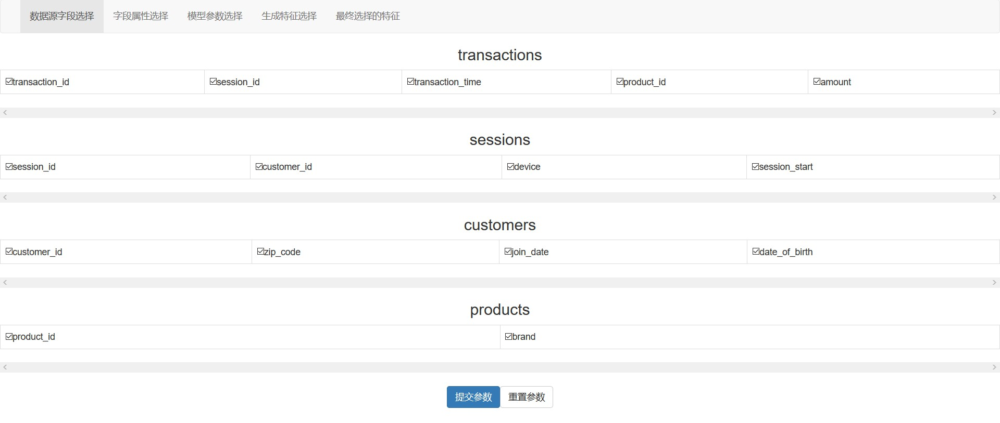
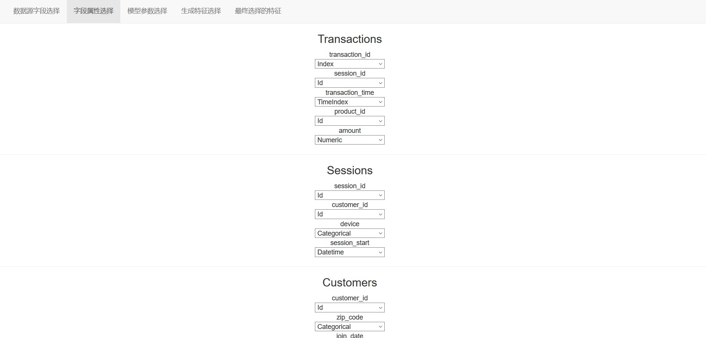
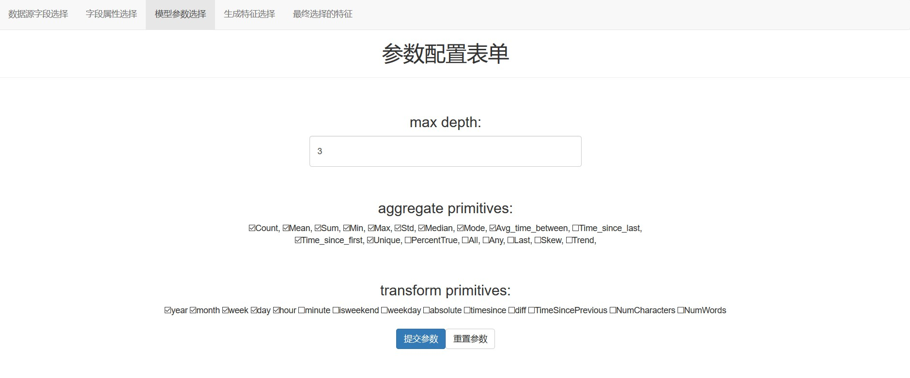
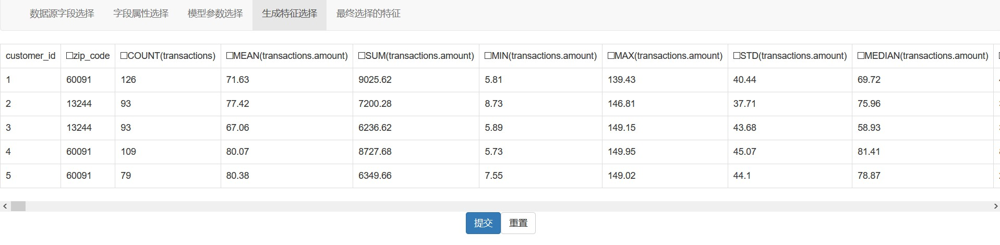
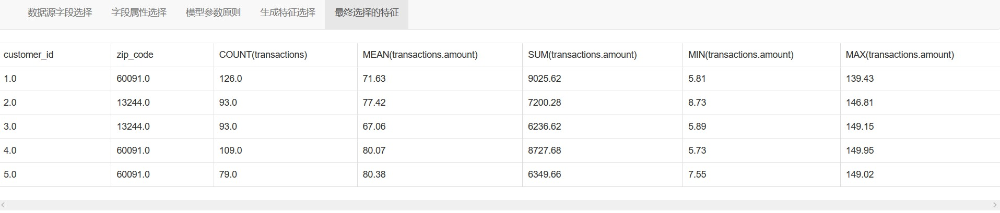

# Django_FeatureTools
FeatureTools的Django版本，将特征融合的过程做成可以手动选择的界面。

融合的核心组件为featuretools, 后端开发使用Django。

依赖环境安装请使用
```
pip install -r requirements.txt
```

安装完成后在根目录下输入命令
```
python manage.py runserver
```
即可运行

运行界面演示：

1. 数据源表和字段的选择界面

<div align="center">  </div>

2. 字段属性的选择界面

<div align="center">  </div>

3. 模型参数的配置界面

<div align="center">  </div>

4. 生成的全部特征展示，并且可以人工选择需要的生成特征，全部特征结果和数据保存在根目录all_features.csv中

<div align="center">  </div>

5. 手工选择的特征界面，手动选择的特征和结果保存在根目录 selected_features.csv 中.

<div align="center">  </div>

对于上游数据源，要求是dict保存的dataframe格式。


